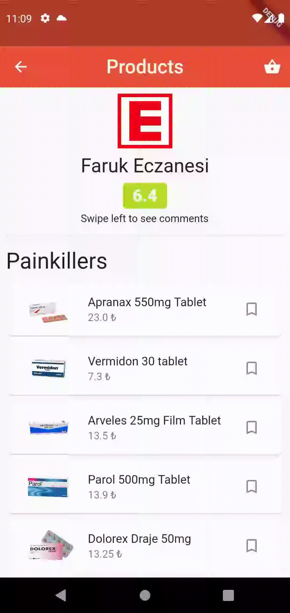

# PharMapp

## Description

PharMapp is a prototype Flutter application that aims to enable its users to shop online in pharmacies and was developed in accordance with the Mobile Application Development course of Sabancı University coded as CS310.

Required backend service is provided by Firebase. Firebase Authentication (for Email/Password, Google, Facebook, Anonymous sign-in methods), Firestore Database (for storing pre-defined addresses, user information, product pool, pharmacy information, orders given by users, comments left on pharmacies, bookmarks created by users), Firebase Storage (for storing profile pictures of users, images of products that being sold) and Firebase Analytics services are used when necessary.

## Details

### Walkthrough, Login and Home Screen

Here user can login with email and password, google or facebook, or can continue anonymously


<p align="center">


</p>

### Address Addition
Pharmacies serves certain addresses, so user adds one or more address from a dropdown menu. Address structure consists of only cities to keep it simple. They are also predefined in Firestore Database.

<p align="center">

</p>

### Listing Pharmacies Serving In Selected City and Their Products, Adding to Basket, Viewing Comments, Bookmarking a Product
<p align="center">




</p>

### Buying Products Added to Basket, Adding to Basket from Bookmarks - Removing Bookmark
<p align="center">


</p>

### Rating Purchases, Adding a Pharmacy to Favorites
<p align="center">


</p>

### Changing Name and Profile Picture, Managing Delivery Addresses, Favorite Pharmacies and Bookmarks
<p align="center">


</p>

### Opening Pharmacy, Selling Items, Changing Prices and Deleting Products
<p align="center">


</p>

### Logging Out, Anonym Shopping
<p align="center">

</p>

## Notes Regarding the Code
State management is done with `StreamBuilder<Object>`. Functions used to flow data are defined in `lib/services`. `auth.dart` contains sign-in methods and Firestore Storage upload functions, while `database.dart` containing 7 different classes:

`DatabaseServices`: Functions related to user information flows and updates

`DatabaseServices_pharm`: Functions related to pharmacy information flows and updates

`DatabaseServices_address`: Functions related to address information flows and updates

`DatabaseServices_product`: Functions related to product information flows and updates

`DatabaseServices_order`: Functions related to order information flows and updates

`DatabaseServices_comment`: Functions related to comment information flows and updates

`DatabaseServices_bookmark`: Functions related to bookmark information flows and updates


### Above classes may require and id or list of ids to function. In case of a function belonging to any of above classes but not needing id nor ids, pass an empty string and list to those parameters:

```
DatabaseService_pharm(id:"SwkUgHqGXT65D", ids:[]).pharmdata
//returns a single pharmacy document with given id from Firebase
//as a Stream object 
```

```
DatabaseService_pharm(id:"", ids:["SwkU","gHqGX","T65D"]).pharms
//returns a list of pharmacy documents with given ids from Firebase
//as a Stream object 
```
